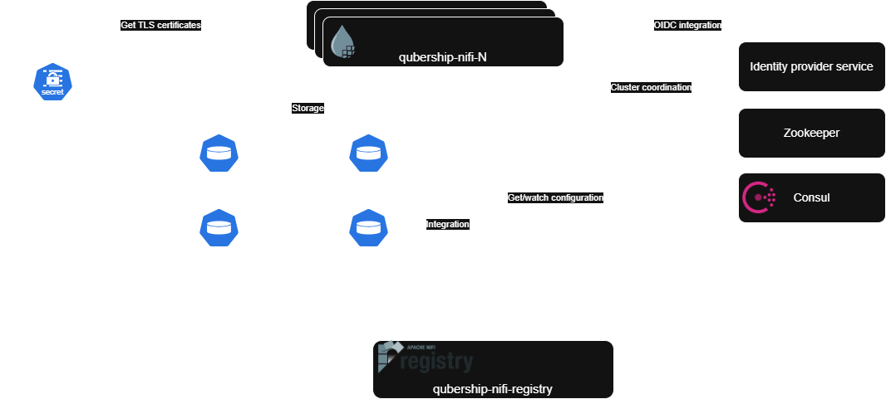

# qubership-nifi

qubership-nifi is a service extending Apache NiFi.
Apache NiFi is scalable and configurable dataflow platform.
Compared with Apache NiFi it supports:
1. additional environment variables for configuration
2. integration with Consul as configuration source for logging levels and other configuration properties
3. automated NiFi configuration restore: configuration version to restore can be set via Consul parameter
4. additional processors for various tasks not supported in open-source Apache NiFi: bulk DB operations, complex JSON extract from DB, rules-based validation
5. reporting tasks for additional monitoring of NiFi processes.

## Status


## Overview



qubership-nifi is scalable and configurable dataflow platform.
Depending on configuration, it relies on:
1. externally provided TLS certificates: TLS is required for security to be enabled, so TLS certificates are need for all configurations, except may be configuration for local development
2. Consul service: used as property source, as well as for configuring logging levels
3. Zookeeper service: required for NiFi clustering, if it's enabled
4. identity provider service: required for OIDC integration, if it's enabled
5. several file-system based repositories:
   1. Persistent Configuration (Database Repository and Flow Configuration). See [Administrator Guide](docs/administrator-guide.md) for more details.
   2. FlowFile Repository. See [Administrator Guide](docs/administrator-guide.md) for more details.
   3. Content Repository. See [Administrator Guide](docs/administrator-guide.md) for more details.
   4. Provenance Repository. See [Administrator Guide](docs/administrator-guide.md) for more details.
6. qubership-nifi-registry: for version control of NiFi flows, as well as export/import for versioned flows.

qubership-nifi can be started in single node (non-cluster) or cluster configuration.
In clustered configuration each cluster node has its own persistent volumes and secrets holding TLS certificates.
qubership-nifi-registry is not clustered and all cluster nodes must connect to the same service.

## Build
### Prerequisites

Build process requires the following tools:
1. Java - JDK 17 or JDK 21
2. Maven - Maven 3.x, see [maven installation guide](https://maven.apache.org/install.html) for details on how to install
3. Docker - any version of Docker Engine or any compatible docker container runtime.

### Project build

To execute maven build, run:
```shell
mvn clean install
```

Once maven build is completed, you can execute docker build. To do that, run:
```shell
docker build .
```

## Documentation

### Installation Guide

[Installation Guide](docs/installation-guide.md)

### Administrator's Guide

[Administrator Guide](docs/administrator-guide.md)

### User Guide

[User Guide](docs/user-guide.md)
